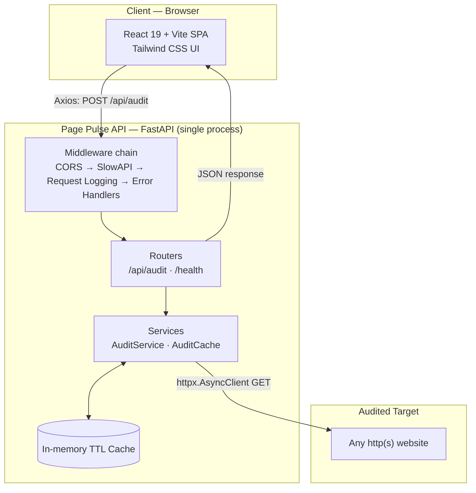
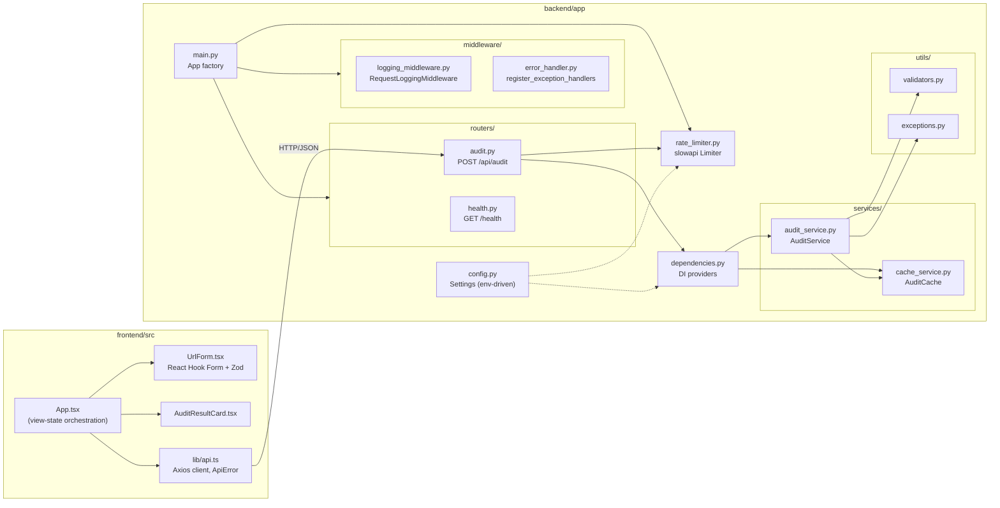
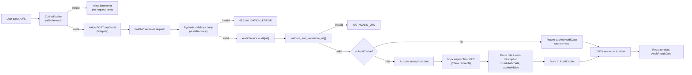
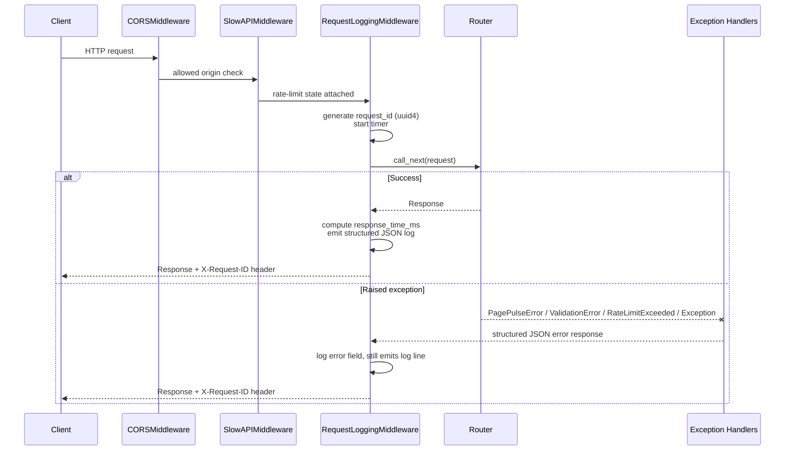
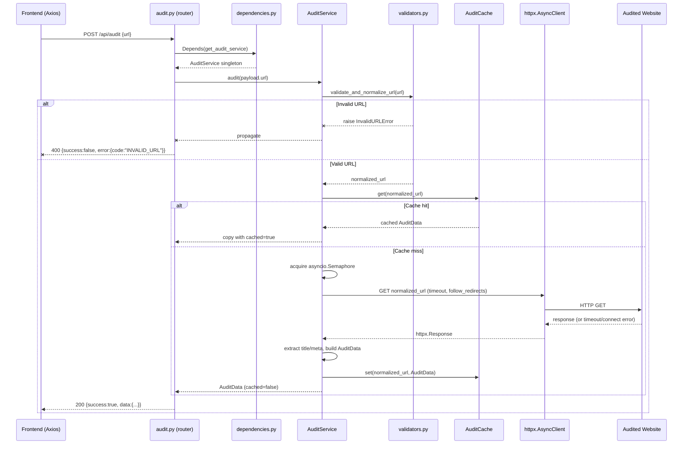
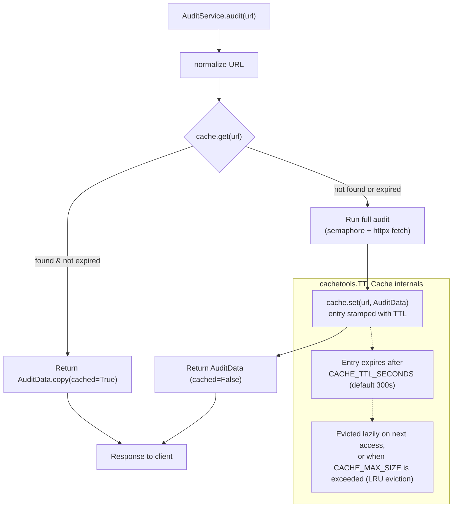
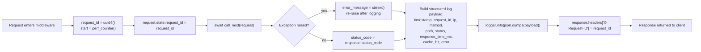

# Page Pulse — System Architecture

This document describes the architecture of Page Pulse as implemented: a FastAPI backend
performing asynchronous URL audits, and a React/Vite/TypeScript frontend consuming it. It
reflects the actual code in `backend/app/` and `frontend/src/` — no proposed or aspirational
components are included here.

## Table of Contents

- [High-Level Architecture](#high-level-architecture)
- [Component Diagram](#component-diagram)
- [Data Flow](#data-flow)
- [Request Lifecycle](#request-lifecycle)
- [API Flow](#api-flow)
- [Cache Flow](#cache-flow)
- [Logging Flow](#logging-flow)

---

## High-Level Architecture

Page Pulse is a two-tier system: a stateless SPA and a stateless (aside from its in-memory
cache) API service. There is no database and no external message broker — state that needs
to persist across requests lives only in two in-process structures owned by the backend: the
`AuditCache` (a `cachetools.TTLCache`) and the `slowapi` rate-limiter's counter store.



**Key architectural properties:**

- **Stateless horizontally, stateful locally.** Each backend process holds its own cache and
  rate-limit counters in memory. Running multiple instances behind a load balancer (see
  `docs/scaling.md`) means cache hits and rate limits are currently per-instance, not
  shared — an explicit, documented trade-off of the current single-process design.
- **No business logic in the HTTP layer.** Routers (`app/routers/audit.py`,
  `app/routers/health.py`) only parse input, call a service, and shape the response.
- **Single external dependency at runtime.** The only outbound network call the backend
  makes is the `httpx.AsyncClient` GET request to the audited URL.

---

## Component Diagram



Each subdirectory has exactly one responsibility, matching the folder structure declared in
`README.md`:

| Layer | Directory | Responsibility |
|---|---|---|
| Transport | `routers/` | Parse HTTP requests, call one service, return a schema |
| Business logic | `services/` | Fetching, parsing, caching, concurrency control |
| Contract | `schemas/` | Pydantic v2 request/response models |
| Cross-cutting | `middleware/` | Logging and global error translation |
| Pure functions | `utils/` | URL validation, typed exceptions |
| Wiring | `dependencies.py`, `main.py` | Dependency injection, app assembly |

---

## Data Flow

Data flows in one direction per request — there is no bidirectional streaming or
server-push. The diagram below traces a single audit from user input to rendered result.



---

## Request Lifecycle

Every request to the FastAPI app — not just `/api/audit` — passes through the same
middleware chain, registered in `app/main.py` in this order:



This guarantees two invariants regardless of outcome:

1. **Every response carries `X-Request-ID`**, set by `RequestLoggingMiddleware` in a
   `finally`-adjacent path so it applies to both success and error responses.
2. **Every response body conforms to the `{success, data}` / `{success, error}` envelope** —
   enforced by `register_exception_handlers`, which registers handlers for
   `PagePulseError`, `RequestValidationError`, `RateLimitExceeded`, and the bare `Exception`
   class as a catch-all.

---

## API Flow

Detailed sequence for `POST /api/audit`, covering the dependency-injected service layer:



---

## Cache Flow

The cache is a single `cachetools.TTLCache` wrapped by `AuditCache`
(`services/cache_service.py`), keyed by the **normalized URL string**, constructed once as a
process-lifetime singleton via `dependencies.get_audit_cache()` (`@lru_cache`).



Notes that match the implementation directly:

- **Cache key = normalized URL, not the raw input string.** `validate_and_normalize_url()`
  runs before the cache lookup, so `https://example.com` and a URL with surrounding
  whitespace resolve to the same cache entry.
- **The rate limiter check happens independently of the cache.** Because `@limiter.limit`
  decorates the route function itself, a cached response still consumes one unit of the
  caller's rate-limit quota — only the expensive upstream fetch is skipped.
- **TTL and max size are both configurable** via `CACHE_TTL_SECONDS` and `CACHE_MAX_SIZE`
  (see `docs/decisions.md` and the root `README.md` for the full environment variable
  table).

---

## Logging Flow

`RequestLoggingMiddleware` (`middleware/logging_middleware.py`) is the single source of
structured logs for HTTP traffic. It emits one JSON line per request to the
`page_pulse.access` logger; `middleware/error_handler.py` additionally logs unexpected
exceptions (with full traceback, server-side only) to `page_pulse.errors`.



Example log line as actually emitted:

```json
{"timestamp": "2026-07-27T05:30:24Z", "request_id": "0f7b5905-2c67-4b27-893e-ee3ccdad928f", "ip": "127.0.0.1", "method": "POST", "path": "/api/audit", "status": 200, "response_time_ms": 187.42, "cache_hit": false, "error": null}
```

The `cache_hit` field is populated by the router (`request.state.cache_hit =
result.cached`) after the service call returns, then read by the logging middleware once
`call_next` completes — this is why cache-hit visibility lives in the log line without the
logging middleware needing any knowledge of the audit domain itself.

See `docs/monitoring.md` for how this logging foundation extends into request-tracing,
metrics, and alerting as the service scales.
