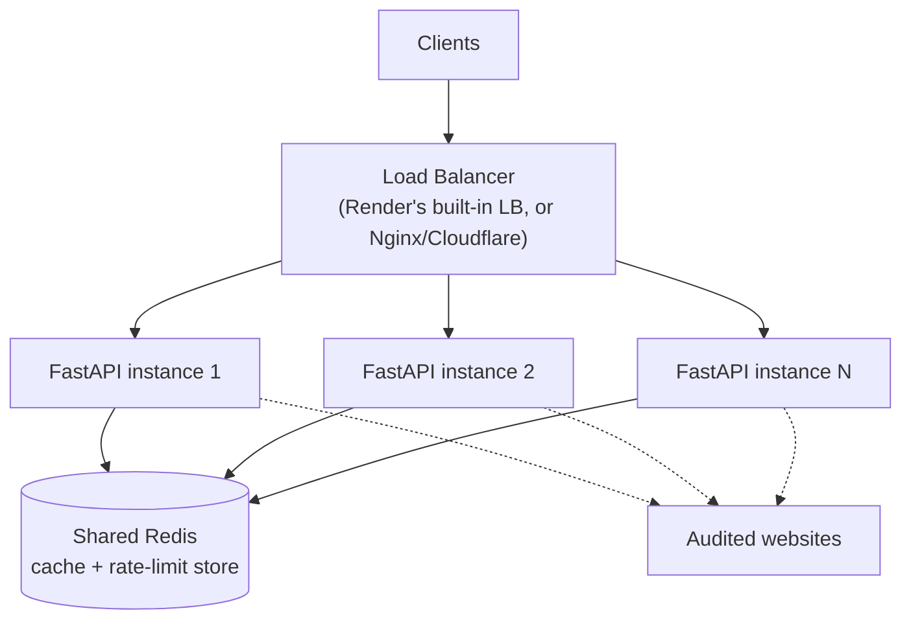

# Page Pulse — Scaling Strategy

This document describes how Page Pulse, as currently implemented, would evolve to handle
load well beyond its current single-process deployment target. It's organized as a growth
path — each stage builds on the last, and none require a rewrite of the existing
`AuditService` / `AuditCache` / router structure described in `docs/architecture.md`.

## Table of Contents

- [Current Baseline](#current-baseline)
- [Stage 1 — 100 requests/day](#stage-1--100-requestsday)
- [Stage 2 — Thousands of requests/day](#stage-2--thousands-of-requestsday)
- [Stage 3 — Tens of requests/second (sustained)](#stage-3--tens-of-requestssecond-sustained)
- [Stage 4 — ~1000 requests/minute](#stage-4--1000-requestsminute)
- [Component-by-Component Scaling Notes](#component-by-component-scaling-notes)
- [Database — If Needed](#database--if-needed)
- [Summary Table](#summary-table)

---

## Current Baseline

The implementation as it stands is a **single FastAPI process**, holding two pieces of
in-memory state:

1. `AuditCache` — a `cachetools.TTLCache`, capped at `CACHE_MAX_SIZE` entries.
2. slowapi's rate-limit counters — in-memory, per-IP.

Outbound concurrency is capped by a single `asyncio.Semaphore(MAX_CONCURRENT_AUDITS)`
inside that one process. This design is appropriate for the project's current scope — no
Docker, no Redis, no Postgres — and comfortably serves low, bursty traffic. The scaling
path below identifies precisely which of these single-process assumptions breaks first,
and what replaces it.

---

## Stage 1 — 100 requests/day

**~1 request every ~15 minutes on average, likely bursty around a few minutes at a time.**

At this volume, the current architecture requires **no changes at all**:

- A single `uvicorn` process (or Render's default single web-service instance) comfortably
  absorbs this load — even a burst of a few dozen simultaneous audits stays well within
  `MAX_CONCURRENT_AUDITS` (default 5) without meaningful queuing.
- The in-memory `AuditCache` and slowapi counters are fine as-is; there's only one process,
  so there's no consistency concern between instances.
- The default `RATE_LIMIT_DEFAULT` of `100/hour` per IP is already generous relative to
  this overall volume.

This is the deployment described in the root `README.md`'s Render/Netlify instructions,
unmodified.

---

## Stage 2 — Thousands of requests/day

**Tens of requests/hour sustained, occasional bursts of dozens at once.**

Still no architectural change is required, but two configuration adjustments become worth
making:

- **Raise `MAX_CONCURRENT_AUDITS`** from its default of 5 if audited sites are typically
  slow to respond — the semaphore, not raw request volume, is what determines whether
  requests start queuing at this stage. This is a pure environment-variable change, no
  code change.
- **Consider a slightly longer `CACHE_TTL_SECONDS`** if the same small set of URLs is
  audited repeatedly (e.g. a small monitoring dashboard polling a fixed list) — cache hit
  rate has an outsized effect on both latency and outbound load at this stage, and it's a
  free win before any infrastructure change.

A single Render web service instance is still the right deployment shape here.

---

## Stage 3 — Tens of requests/second (sustained)

This is the point where the single-process assumptions in the current implementation start
to matter, and where the first real infrastructure changes are introduced:

- **Multiple FastAPI instances behind a load balancer.** Because `AuditService` is
  constructed as a stateless-per-request singleton (via `dependencies.get_audit_service`)
  and holds no data that can't be reconstructed, running N copies of the same process is
  safe with zero code changes to the service logic itself — this is the direct payoff of
  the current architecture's statelessness.
- **A shared cache becomes necessary.** With multiple instances, each process's
  `AuditCache` is independent — instance A audits `example.com`, but instance B has no
  knowledge of that and will re-fetch on the next request routed to it, defeating much of
  the cache's purpose. This is the point at which **Redis** replaces `cachetools.TTLCache`
  as the backing store: same TTL semantics, but shared across every instance. Because
  `AuditCache` is already a thin wrapper class (`services/cache_service.py`) with just
  `get`/`set`/`__len__`/`clear`, swapping its internals for a Redis client is a
  contained change — the rest of `AuditService` doesn't need to know the cache moved.
- **A shared rate-limit store becomes necessary for the same reason.** slowapi supports a
  Redis-backed storage backend as a direct drop-in replacement for its default in-memory
  store — this is a configuration change to the `Limiter`'s `storage_uri`, not a rewrite of
  the rate-limiting logic in `routers/audit.py`.
- **Structured logs need centralizing.** With N processes, `docker logs`-style per-instance
  log access stops being practical — this is where the log-aggregation work described in
  `docs/monitoring.md` becomes a prerequisite for debugging, not a nice-to-have.

---

## Stage 4 — ~1000 requests/minute

**~17 requests/second sustained, likely with sharper bursts.**

This is a meaningful jump from Stage 3, and it's the point where a few additional
decisions come into play, beyond simply adding more instances:

- **Horizontal scaling becomes the primary lever, not vertical.** Because each audit is an
  independent, stateless unit of work, adding more FastAPI instances behind the load
  balancer scales throughput close to linearly — this is the direct benefit of having no
  server-affinity requirement in the current design (no sticky sessions, no per-instance
  state that a client depends on).
- **The outbound side becomes the real constraint, not the inbound side.** At this volume,
  the limiting factor is less "can FastAPI accept 1000 requests/minute" (trivially yes,
  across a handful of instances) and more "how much outbound fetch concurrency is safe and
  polite toward audited third-party sites." This is where `MAX_CONCURRENT_AUDITS` per
  instance, multiplied by instance count, needs to be tuned deliberately — e.g. 4 instances
  × `MAX_CONCURRENT_AUDITS=20` gives 80 concurrent outbound audits cluster-wide, a number
  that should be chosen based on the audited sites' own tolerance, not just Page Pulse's
  own capacity.
- **A queue becomes worth considering — but only for a specific reason.** The current
  design executes each audit synchronously within the request/response cycle: the caller
  waits for the fetch to complete. At sustained high volume, if audits routinely queue
  behind the semaphore, callers start experiencing that queuing as added HTTP latency. A
  queue (e.g. Redis-backed via Celery/RQ, or FastAPI `BackgroundTasks` for simpler cases)
  would let `POST /api/audit` return an immediate `202 Accepted` with a job ID, and move
  actual execution off the request path — trading synchronous simplicity for better
  perceived latency under load. This is a genuine architectural change (new response
  shape, a polling or webhook mechanism for results) and should only be taken if request
  latency under load is actually a measured problem — not adopted preemptively.
- **Rate limiting needs a global, not just IP-based, safety valve.** Per-IP limits protect
  against a single abusive caller, but at this scale it's also worth adding a
  cluster-wide concurrency ceiling (distinct from the per-instance semaphore) to guarantee
  the *total* outbound fetch rate stays within what's operationally acceptable, regardless
  of how many distinct IPs are calling.

---

## Component-by-Component Scaling Notes

| Component | Stage 1–2 (current) | Stage 3+ |
|---|---|---|
| **FastAPI process** | Single instance | Multiple instances behind a load balancer |
| **Cache** | In-process `cachetools.TTLCache` | Shared Redis, same TTL contract |
| **Rate limiting** | slowapi, in-memory, per-instance | slowapi, Redis-backed storage, shared across instances |
| **Concurrency control** | Single `asyncio.Semaphore` per process | Per-instance semaphore, sized deliberately alongside instance count |
| **Logging** | stdout, structured JSON | Shipped to a centralized log platform (see `docs/monitoring.md`) |
| **Load balancing** | None (single instance) | Render's built-in LB, or Cloudflare/Nginx in front of multiple Render services |
| **Long-running work** | None — request/response is fully synchronous | Optional queue (Celery/RQ) if synchronous latency becomes a problem under sustained load |

---

## Database — If Needed

The current implementation has **no database**, and audit results are explicitly
ephemeral — a `TTLCache` entry, not a persisted record. This remains correct through every
stage above, *unless* a new requirement is introduced that the current scope doesn't cover:

- **Historical audit trends** (e.g. "show me this URL's uptime over the last 30 days") —
  this requires persistence beyond the cache's TTL window, and would introduce a
  lightweight time-series-friendly store (e.g. Postgres with a simple `audits` table
  indexed on `(url, timestamp)`, or a purpose-built time-series database if volume is
  very high).
- **User accounts / saved URL lists** — if Page Pulse grows a "monitor these URLs for me"
  feature, a relational database (Postgres) becomes the natural fit for users, saved
  URLs, and notification preferences.
- **Audit-level rate limiting or quotas per account** (as opposed to per-IP) — would also
  need persistent user/account state.

None of these are implemented today, and none are required to hit 1000 requests/minute of
the *existing* stateless audit functionality — they are separate feature decisions, listed
here only so the scaling story is explicit about where the current "no database" design
would need to change, versus where it comfortably continues to hold.

---

## Summary Table

| Volume | Instances | Cache | Rate limiting | Notes |
|---|---|---|---|---|
| 100 requests/day | 1 | In-process `TTLCache` | In-memory, default `100/hour` | No changes needed |
| Thousands/day | 1 | In-process `TTLCache` | In-memory | Tune `MAX_CONCURRENT_AUDITS` and `CACHE_TTL_SECONDS` |
| Tens of req/sec | 2–5 (load balanced) | Shared Redis | Redis-backed slowapi | Centralized logging becomes necessary |
| ~1000 req/min | 4+ (load balanced, tuned) | Shared Redis | Redis-backed, plus cluster-wide concurrency ceiling | Queue considered only if latency-under-load is a measured problem |

The through-line across every stage: the current separation between routers, `AuditService`,
and `AuditCache` (see `docs/architecture.md`) means scaling is almost entirely a matter of
**where state lives** (in-process vs. shared) and **how many processes run** — not a
rewrite of the request-handling logic itself.
